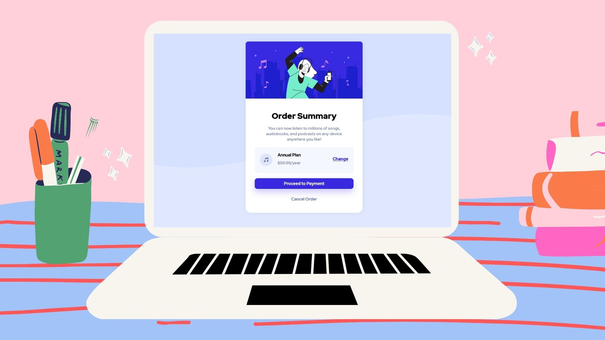

# Frontend Mentor - Order summary card solution

This is a solution to the [Order summary card challenge on Frontend Mentor](https://www.frontendmentor.io/challenges/order-summary-component-QlPmajDUj). Frontend Mentor challenges help you improve your coding skills by building realistic projects. 

## Table of contents

- [Overview](#overview)
  - [The challenge](#the-challenge)
  - [Screenshot](#screenshot)
  - [Links](#links)
- [My process](#my-process)
  - [Built with](#built-with)
  - [Useful resources](#useful-resources)
- [Author](#author)
- [Acknowledgments](#acknowledgments)

## Overview

### The challenge

Users should be able to:

- See hover states for interactive elements

### Screenshot

### Links

- Solution URL: [Github Repository](https://github.com/chanenbrin/Order-Summary-Component)
- Live Site URL: [Github Page](https://chanenbrin.github.io/Order-Summary-Component/)

## My process

### Built with

- Semantic HTML5 markup
- CSS custom properties

### Useful resources

- [MDN Web Docs](https://developer.mozilla.org/en-US/docs/Web) - This is an amazing article which helped me finally understand HTML Tags CSS Properties and more. I'd recommend it to anyone still learning this concept.
- [CSS Button Creator](https://cssbuttoncreator.com/) - This helped me for making button. I really liked this pattern and will use it going forward.
- [Google Fonts](https://fonts.google.com/) - This helped me to have access to the font used for this project. This is very useful.

## Author

- Website - [Chen Brin](https://github.com/chanenbrin)
- Frontend Mentor - [@ChenBE9494](https://www.frontendmentor.io/profile/ChenBE9494)
- Instagram - [@chnncltbrn] (https://www.instagram.com/chnncltbrn)

## Acknowledgments

Thanks to my Web Dev. Instructor Dr. Angela Yu of Udemy for teaching her knowledge about Full-Stack Web Development and guide me through this challenge.

"Fight! We can do this! WHEN YOU STUCK AT PROGRAMMING... DON'T GIVE UP! TAKE IT AS A CHALLENGE!"
